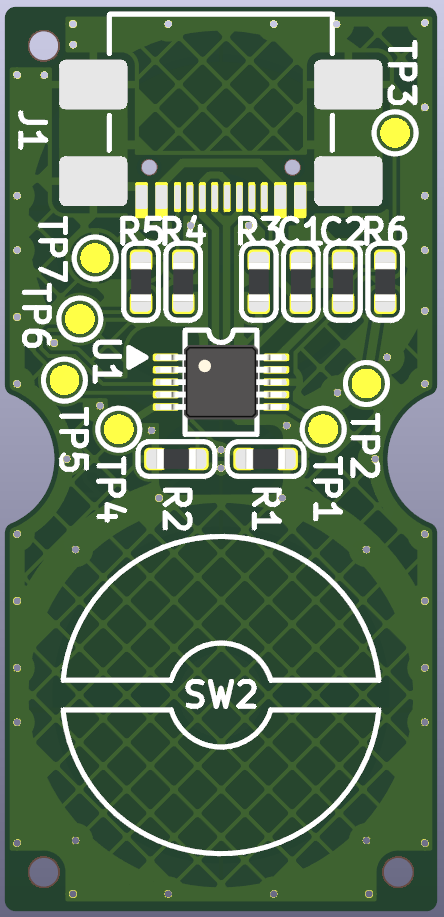

# ECmacro

A compact USB macro pad using electrostatic capacitive switches (Topre/NIZ style).  
| Model | Key Count | Typical Use |
|-------|-----------|-------------|
| **ECmacro 02** | 2 keys | Volume / Mute |

---

## 🖼️ Gallery

---

## 📦 Features

- Electrostatic capacitive switches (Topre/NIZ style)
- USB HID device with CH552 microcontroller
- Functions:
  - Volume Up (Key 1)
  - Volume Down (Key 2)
  - Mute (Simultaneous press)
- Open-source hardware and firmware
USB VID/PID assigned via [pid.codes](https://pid.codes/) (requested: VID 0x1209 / PID 0xEC02, status: pending).

---

## 🖥️ Supported OS

- Windows 10/11
- macOS (10.14+)
- Linux (kernel with HID support)

---

## 🔍 Hardware Resources

- [Schematics (PDF)](./hardware/ecmacro02_schematic.pdf)
- [Gerber](./hardware/ecmacro02_gerber.zip)
- [BOM (CSV)](./hardware/ecmacro02_bom.csv)
- [CPL (CSV)](./hardware/ecmacro02_positions.csv)

---

## 🧩 Firmware

- [Firmware (.ino)](./firmware/ecmacro02/ecmacro02.ino)
  - This project uses [CH55xduino](https://github.com/DeqingSun/ch55xduino).  
    See the firmware directory for source code and pin assignment.
---

## 📄 License

This project uses dual licenses:

- **Firmware and source code**: [MIT License](./LICENSE-MIT.txt)
- **Schematics, PCB layout, and documents**: [CC BY 4.0](./LICENSE-CCBY.txt)

© 2025 QuadState

---

## 🆔 USB PID Registration

This project is in the process of registering a **USB Product ID (PID)** via [pid.codes](https://pid.codes/).  
The tentative assignment is:

- **Vendor ID**: `0x1209` (pid.codes community VID)
- **Product ID**: `0xEC02` (tentative)
- **PID.codes listing**: _Pending approval_

Once approved, the device will identify as:

---

## 💬 Contact & Feedback

Please use [GitHub Issues](https://github.com/QuadState/ecmacro/issues) for questions, bugs, or feedback.  
We welcome contributions, suggestions, and improvements!

---